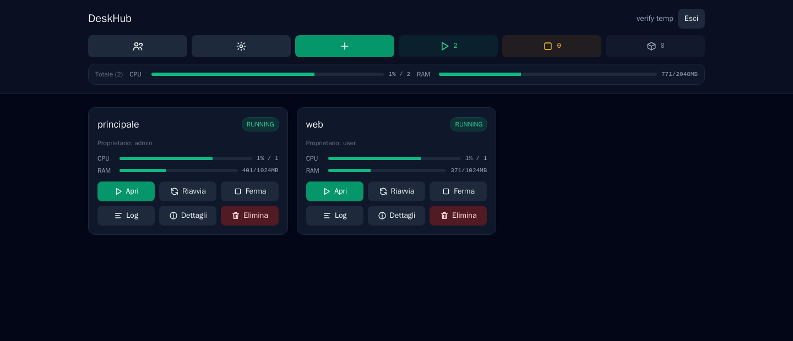
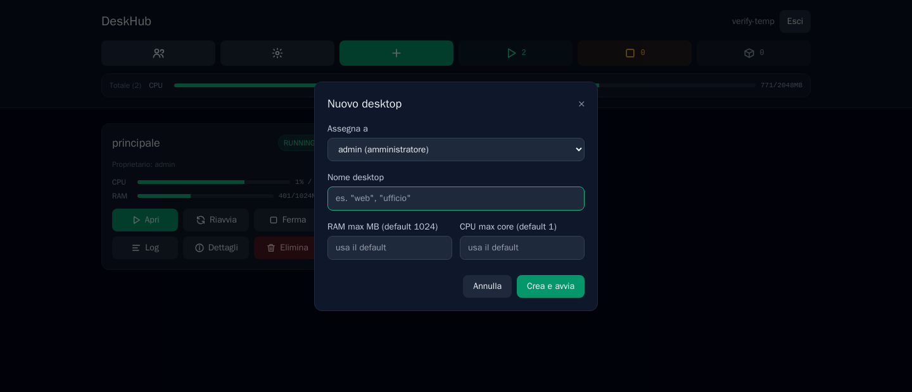
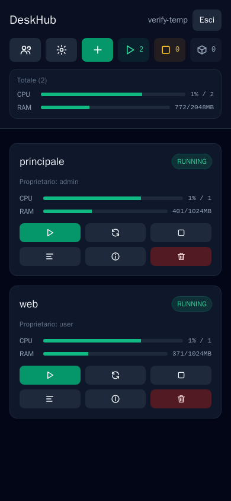

<div align="center">

# 🖥️ DeskHub

**Desktop Linux completi, containerizzati, raggiungibili dal browser — sul tuo hardware, non su un cloud altrui.**

[](LICENSE)
[](https://fastapi.tiangolo.com/)
[](https://react.dev/)
[](https://github.com/selkies-project/selkies)
[](https://traefik.io/)

</div>



DeskHub è una webapp self-hosted per creare, avviare, fermare e gestire
desktop Linux completi (KDE Plasma su Ubuntu) come container Docker
indipendenti, raggiungibili in streaming dal browser. Un desktop-as-a-service
leggero che gira interamente sul tuo hardware: nessun abbonamento, nessun
dato che passa per l'infrastruttura di qualcun altro.

Le piattaforme commerciali di desktop-as-a-service risolvono lo stesso
bisogno — un desktop Linux completo, accessibile da qualsiasi browser, usa e
getta o persistente a piacere — ma con canoni ricorrenti e dati ospitati
altrove. DeskHub nasce per lo stesso bisogno, auto-ospitato: gira sul tuo
server, i dati restano tuoi, il costo è solo quello dell'hardware.

## Indice

- [Funzionalità](#funzionalità)
- [Avvio rapido](#avvio-rapido)
- [Com'è fatto](#comè-fatto)
- [Sicurezza](#sicurezza)
- [Robustezza e auto-contenimento](#robustezza-e-auto-contenimento)
- [Configurazione](#configurazione-env)
- [Note implementative](#note-implementative)
- [Sviluppo locale](#sviluppo-locale)
- [Licenza](#licenza)

## Funzionalità

**🖥️ Desktop**
- Crea, avvia, ferma, riavvia ed elimina desktop KDE Plasma completi con un click
- Nome libero per ogni desktop (es. "web", "ufficio"), non un numero progressivo condiviso con desktop di altri
- Riutilizzo di configurazioni orfane (container perso ma dati ancora sul disco)
- Limiti RAM/CPU sempre attivi per desktop, con default globale e override singolo, modificabili anche a container già avviato

**👥 Utenti e permessi**
- Login gestito dalla webapp stessa: utenti, password, sessione via cookie
- Due ruoli — **admin** (crea/elimina/log/dettagli, gestisce utenti, vede lo stato aggregato di tutti) e **utente** (avvia/ferma/riavvia/apre solo i propri desktop)
- Un utente vede solo ciò che gli appartiene: mai desktop, conteggi o metriche altrui

**📊 Monitoraggio**
- CPU e RAM in tempo reale per singolo desktop e in totale aggregato su tutta la flotta
- Conteggio dal vivo di desktop in esecuzione, fermi e orfani

**🔒 Sicurezza e privacy**
- URL di sessione opachi e a scadenza (stile Kasm): mai un percorso fisso o indovinabile verso un desktop
- Spegnimento automatico configurabile dopo N minuti di esecuzione continua
- Cartelle di configurazione protette: permessi o proprietario alterati da fuori bloccano l'avvio con un errore esplicito, invece di un fallimento silenzioso

**📦 Distribuzione**
- Un solo comando (`install.sh`) prepara host, rete, reverse proxy e webapp da zero
- Nessuna dipendenza da Docker Hub o da registri upstream a runtime: tutto pinnato per digest su GHCR (vedi [Robustezza e auto-contenimento](#robustezza-e-auto-contenimento))

## Avvio rapido

Su un host Ubuntu/Debian pulito:

```bash
curl -fsSL https://raw.githubusercontent.com/FedericoCasillo/deskhub/master/install.sh -o install.sh
bash install.sh
```

(Non usare `curl | bash`: lo script chiede utente/password in modo
interattivo, e con la pipe non riesce a leggerli dal terminale.)

Alla fine stampa l'URL (`https://<ip>:8443/manager/`, ma basta anche la sola
radice `https://<ip>:8443/`: reindirizza lì in automatico) e le credenziali
impostate durante l'installazione. Lo script è pensato per essere
rilanciato: se trova un'installazione esistente la aggiorna (`git pull` +
rebuild) invece di ripartire da zero — è anche il modo per aggiornare in
futuro.

Variabili opzionali per un'installazione non interattiva (env var da
esportare prima di lanciare lo script): `TARGET_DIR`, `DATA_DIR`,
`HTTPS_PORT`, `MANAGER_INITIAL_ADMIN_USER`, `MANAGER_INITIAL_ADMIN_PASSWORD`,
`SKIP_TRAEFIK` (se hai già un tuo reverse proxy sulla rete `deskhub-proxy`).

<details>
<summary><strong>Installazione manuale (passo per passo)</strong></summary>

1. Clona il repo e crea una cartella dati dedicata (**non** la tua home
   intera: il manager monta esattamente questo path, quindi vede solo
   quello che c'è lì dentro):

   ```bash
   git clone https://github.com/FedericoCasillo/deskhub.git
   mkdir -p ~/deskhub-data
   ```

2. Crea `.env` (vedi `.env.example`): imposta `DATA_DIR` con il path appena
   creato e `MANAGER_INITIAL_ADMIN_USER`/`MANAGER_INITIAL_ADMIN_PASSWORD` con
   le credenziali del primo amministratore (usate solo al primissimo avvio,
   quando non esiste ancora nessun utente — dopo il bootstrap si gestiscono
   utenti e password dalla webapp, pulsante "Utenti"). Se la password
   contiene un `$`, raddoppialo (`$$`): Docker Compose interpola i `$` nei
   file `.env`.

3. Rete condivisa, certificato TLS persistente e reverse proxy:

   ```bash
   docker network create deskhub-proxy

   mkdir -p deploy/traefik/certs
   openssl req -x509 -nodes -newkey rsa:2048 -sha256 -days 3650 \
     -keyout deploy/traefik/certs/key.pem -out deploy/traefik/certs/cert.pem \
     -subj "/CN=deskhub" \
     -addext "subjectAltName=DNS:localhost,IP:127.0.0.1,IP:<ip-del-server>"

   cd deploy/traefik && docker compose up -d && cd ../..
   ```

   Il certificato va generato **una volta sola**: non è nel repo (è
   specifico dell'host) e non va rigenerato ai riavvii. Se lo si rigenera o
   lo si cancella, il browser tornerà a chiedere di accettarlo di nuovo.

4. Avvio del manager (scarica lo snapshot pinnato da GHCR, non builda nulla
   in locale — per buildare da sorgente invece, `MANAGER_SOURCE=build docker
   compose build` prima del resto):

   ```bash
   docker pull ghcr.io/federicocasillo/deskhub-manager@sha256:05cfa08a08cea108f652ffc80fbaa9811469a962e900ebe6a84d031a5248aa9d
   docker tag ghcr.io/federicocasillo/deskhub-manager@sha256:05cfa08a08cea108f652ffc80fbaa9811469a962e900ebe6a84d031a5248aa9d deskhub-manager:latest
   docker compose up -d
   ```

5. Apri `https://<ip-del-server>:8443/manager/` (accetta il certificato
   self-signed di Traefik) e accedi con le credenziali del punto 2.

</details>

<details>
<summary><strong>Creare un desktop</strong></summary>



Dalla dashboard admin, "+ Nuovo desktop": scegli il proprietario, dai un
nome al desktop (diventa anche il nome che vedrà l'utente sulla sua card) ed
eventualmente un limite RAM/CPU diverso dal default globale. L'identificativo
interno e la cartella di configurazione diventano `<proprietario>-<nome>`
(es. `mario-web`), con un suffisso numerico in caso di doppioni
(`mario-web-2`, ...).

</details>

<details>
<summary><strong>Responsive, anche da telefono</strong></summary>



</details>

## Com'è fatto

- **Backend**: Python + FastAPI, parla direttamente col socket Docker via
  `docker-py` (nessuno shell-out a `docker` o `docker compose` a runtime).
- **Frontend**: React + Vite + Tailwind, servito come build statica dallo
  stesso container del backend.
- **Realtime**: WebSocket per il progress delle operazioni lunghe
  (crea/avvia/ferma/riavvia/elimina) e per il live-tail dei log.
- **Reverse proxy**: Traefik, con TLS self-signed persistente.
- **Autenticazione e permessi**: login gestito dalla webapp stessa (utenti,
  password, sessione via cookie), non da Traefik. Due ruoli: **admin**
  (crea/elimina/vede i log e le info di ogni desktop, gestisce gli utenti,
  vede i conteggi RUN/STOP/ORPH e l'uso CPU/RAM aggregato di tutti i desktop
  di tutti gli utenti) e **utente** (vede e opera solo sui desktop assegnati
  a lui — avvia, ferma, riavvia, apre — niente creazione, eliminazione, log,
  né i conteggi/uso complessivi, che riguardano desktop che potrebbe non
  aver mai visto).
- **Immagine desktop**: Ubuntu + KDE Plasma via
  [LinuxServer.io Webtop](https://github.com/linuxserver/docker-webtop)
  (streaming con [Selkies](https://github.com/selkies-project/selkies)),
  con una configurazione personalizzata che disattiva le funzioni della UI
  non necessarie (condivisione, gamepad, secondo schermo, ecc.) per
  un'esperienza più snella. Nessuna affiliazione ufficiale con
  LinuxServer.io: è una build derivata, redistribuita nel rispetto della
  licenza open source del progetto originale.

```
                    ┌─────────────────────────────┐
   browser  ───────▶│   Traefik (TLS, routing      │
                     │   dinamico per sessione)     │
                     └──────────────┬──────────────┘
                                     │
                         ┌───────────┴───────────┐
                         ▼                        ▼
                ┌────────────────┐      ┌──────────────────┐
                │  DeskHub        │      │  desktop KDE #1   │
                │  (FastAPI+React)│      │  desktop KDE #2   │
                │  parla con      │      │  ...              │
                │  /var/run/      │◀────▶│  (container       │
                │  docker.sock    │      │   Docker isolati) │
                └────────────────┘      └──────────────────┘
```

## Sicurezza

- **Nessun percorso fisso verso un desktop.** Al click su "Apri", il manager
  verifica sessione utente + proprietà del desktop e genera un token opaco a
  scadenza (12h, in memoria — non sopravvive a un riavvio del manager, né
  serve: un nuovo click ne genera uno nuovo). L'unico URL pubblico è
  `/session/<token>/`. Traefik non ha nessuna route statica per i desktop:
  le legge da un endpoint interno del manager (`GET /internal/traefik-config`,
  protetto da un segreto condiviso `TRAEFIK_INTERNAL_SECRET`, mai esposto
  pubblicamente) che elenca solo le sessioni valide in quel momento e
  instrada verso l'IP del container giusto sulla rete Docker. Indovinare o
  enumerare un URL non porta a nessun desktop. Fermare, riavviare o
  eliminare un desktop revoca subito le sue sessioni aperte.
- **Cartelle di configurazione blindate.** Se una cartella di config viene
  modificata da fuori al manager (permessi cambiati, proprietario diverso da
  quello atteso, symlink sospetto), il manager rifiuta di avviare o riusare
  quel desktop con un errore esplicito — mai un avvio silenzioso su dati
  manomessi, né un fallimento oscuro dentro il container.
- **Niente account Linux legato all'utente del manager.** Dentro ogni
  container l'account è sempre lo stesso (`abc`, fisso): nessun legame tra
  nome utente del manager e account di sistema del desktop.
- **Un utente vede solo i suoi desktop.** Nessun conteggio, metrica o log
  che riveli l'esistenza di desktop altrui.

## Robustezza e auto-contenimento

Per default l'installazione **non dipende da nessun registro esterno**
oltre a GitHub: le tre immagini che servono (manager, desktop, Traefik) sono
snapshot pubblicati su GitHub Container Registry sotto questo stesso account
(`ghcr.io/federicocasillo/deskhub-manager`, `deskhub-webtop`,
`deskhub-traefik`), scaricati pubblicamente senza bisogno di credenziali, e
referenziati **per digest** (non per tag): un tag su un registro è
riscrivibile (un push accidentale sotto lo stesso tag cambierebbe
silenziosamente cosa scaricano i client), un digest no — è l'unico modo per
cui "immagine pinnata" significhi davvero immutabile.

Questo significa che se LinuxServer.io cambiasse, spostasse o ritirasse
l'immagine Webtop ufficiale, o se una nuova versione di Traefik introducesse
una breaking change, **questa installazione continua a funzionare
comunque**: a runtime non dipende da loro, solo dagli snapshot già scaricati
da GHCR.

Il `Dockerfile` in `webtop-image/` (per il desktop) e quello nella radice
del repo (per il manager stesso) restano comunque nel repo per trasparenza
(sono esattamente ciò che è stato usato per generare gli snapshot
pubblicati) e sono anche il fallback automatico se per qualche motivo GHCR
non fosse raggiungibile. Per buildare da sorgente invece di scaricare lo
snapshot (comportamento opt-in, mai automatico): `WEBTOP_SOURCE=build` in
`.env` per il desktop (rimuovendo prima `docker rmi deskhub-webtop:latest`),
`MANAGER_SOURCE=build` per il manager. Per Traefik, `TRAEFIK_IMAGE=traefik:v3.7`
(o una versione più recente) in `.env` usa l'immagine ufficiale invece di
quella pinnata. Solo in questo percorso opt-in (o nel fallback automatico
per assenza di GHCR) si dipende da Docker Hub/LinuxServer.io — mai
nell'installazione di default.

L'unico scenario in cui questa installazione smette di funzionare da zero è
se GitHub stesso diventasse irraggiungibile o l'account/repo venisse
rimosso — dipendenza accettata consapevolmente, dato che è la piattaforma
che ospita il progetto stesso.

## Configurazione (`.env`)

| Variabile          | Obbligatoria | Default                              | Significato |
|---------------------|:---:|----------------------------------------------|--------------|
| `DATA_DIR`          | sì  | —                                             | Cartella dedicata (host) con le config dei desktop. |
| `MANAGER_INITIAL_ADMIN_USER` | no (solo al primo avvio) | —              | Utente amministratore creato se non esiste ancora nessun utente. |
| `MANAGER_INITIAL_ADMIN_PASSWORD` | no (solo al primo avvio) | —          | Password dell'amministratore iniziale. |
| `TRAEFIK_INTERNAL_SECRET` | sì  | —                                       | Segreto condiviso con Traefik per il routing dinamico verso i desktop (generato da `install.sh`, va passato anche a `deploy/traefik/compose.yml`). |
| `WEBTOP_SOURCE`     | no  | `pull`                                        | `pull` = usa lo snapshot pinnato su GHCR; `build` = ricostruisci sempre da `webtop-image/Dockerfile`. |
| `WEBTOP_IMAGE`      | no  | `deskhub-webtop:latest`                       | Tag locale con cui gira l'immagine desktop. |
| `MANAGER_SOURCE`    | no  | `pull`                                        | `pull` = usa lo snapshot pinnato su GHCR (gestito da `install.sh`); `build` = builda sempre da sorgente. |
| `PROXY_NETWORK`     | no  | `deskhub-proxy`                               | Rete Docker esterna condivisa con Traefik. |
| `TRAEFIK_IMAGE`     | no  | snapshot pinnato su GHCR (in `deploy/traefik`) | Immagine di Traefik da usare. |

### Portare l'installazione su un altro host

`install.sh` fa già tutto questo automaticamente. Se preferisci farlo a
mano: imposta `DATA_DIR` nel nuovo `.env` con un path reale sul nuovo host
e assicurati che un Traefik equivalente giri sulla rete `PROXY_NETWORK`
(entrypoint `websecure`, provider Docker) — quello in `deploy/traefik/`
va bene così com'è.

## Note implementative

<details>
<summary>Dettagli su spegnimento automatico, limiti risorse, sessioni e certificati</summary>

- **Spegnimento automatico.** Dall'icona ⚙ in home si imposta un timeout
  globale (in minuti, 0 = disabilitato): ogni desktop RUNNING da più di N
  minuti viene fermato automaticamente, controllato ogni 60 secondi da un
  task in background nel backend. Non è rilevamento di inattività reale:
  Selkies non espone alcun segnale di input/attività utilizzabile per
  questo — è stato verificato prima di implementare — quindi il timeout
  conta dal momento dell'avvio del container, indipendentemente dall'uso
  effettivo.
- **Limiti CPU/RAM.** Ogni desktop ha sempre un tetto, sia RAM che CPU —
  nessuna risorsa illimitata. Il default globale (Settings, 1 vCPU / 1024 MB
  di fabbrica) si può cambiare in ogni momento, così come l'override per
  singolo desktop da "Dettagli"; su un desktop già esistente, Docker
  permette di alzare o abbassare un limite attivo con il container in
  esecuzione senza doverlo ricreare.
- Il container del manager monta `/var/run/docker.sock` (per gestire i
  container) e `DATA_DIR` **allo stesso path** anche al suo interno: è
  necessario perché i bind-mount dei desktop vengono risolti dal Docker
  daemon dell'host, quindi i path passati devono coincidere con quelli
  reali sull'host.
- "Riavvia" usa `container.restart()` invece di ricreare il container da
  zero: il desktop riparte comunque, il container non viene ricreato.
- Alla prima apertura di un desktop (appena creato o appena riavviato) è
  normale vedere per qualche decina di secondi il messaggio "WebSocket
  disconnected. Attempting to reconnect": è il client dentro il webtop che
  aspetta che il servizio di streaming dello schermo finisca di avviarsi, e
  si connette da solo non appena è pronto.
- Traefik usa un certificato TLS self-signed **persistente**
  (`deploy/traefik/certs/`, generato una volta sola all'installazione), non
  quello effimero interno di Traefik: quest'ultimo si rigenera ad ogni
  reload della configurazione dinamica (cioè ad ogni creazione, avvio,
  arresto o eliminazione di un desktop, chiunque la esegua), invalidando la
  fiducia già data dal browser e rompendo le connessioni websocket già
  aperte in altre schede — si manifesta come schermo nero con errore del
  proxy websocket, risolvibile solo chiudendo e riaprendo la scheda per
  riaccettare il nuovo certificato. Con il certificato persistente questo
  non succede più.

</details>

## Sviluppo locale

```bash
cd backend && pip install -r requirements.txt && uvicorn app.main:app --reload
cd frontend && npm install && npm run dev
```

Il dev server di Vite fa da proxy verso il backend su `localhost:8000` per
`/manager/api` e `/manager/ws`.

## Licenza

Distribuito sotto [PolyForm Noncommercial 1.0.0](LICENSE): uso, modifica e
redistribuzione liberi per scopi non commerciali; l'uso commerciale richiede
un accordo separato con l'autore. L'immagine desktop è una build derivata di
[LinuxServer.io Webtop](https://github.com/linuxserver/docker-webtop),
soggetta alla licenza del progetto originale.

---

<sub>Sviluppato con l'assistenza di Claude Code, con revisione umana su ogni
scelta architetturale e di sicurezza.</sub>
